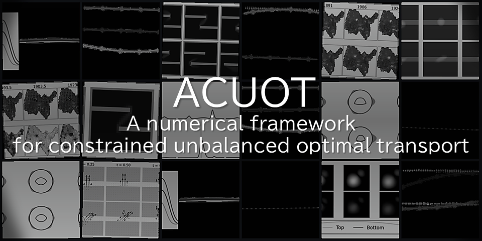

<p align="center">
  
</p>

# ACUOT: Affine-Constrained Unbalanced Optimal Transport

ACUOT is a code for calculating an optimal interpolation between two distributions that may have different total masses while imposing the constraint on the interpolation path. For example, a problem of transporting a population of particles while avoiding obstacles can be solved using this code.

ACUOT is based on the theory of [Wasserstein-Fisher-Rao optimal transport](https://arxiv.org/pdf/1506.06430), and seeks the interpolation path that miminizes the Wasserstein-Fisher-Rao energy while obeying the constraint.

## Mathematical formulation
ACUOT formally solves the following problem: for given two distributions $\rho_0(x), \rho_1(x)$ on a rectangular grid $\Omega$, we find the path of distributions $\rho(t,x) \in [0,\infty)$, the momentum of the mass $\omega(t,x) \in \mathbb{R}^d$, and the source term $\zeta(t, x) \in \mathbb{R}$ (controlls birth-death process of mass) that minimizes the Wasserstein-Fisher-Rao energy:

$$\begin{align} &\textrm{minimize } \frac{1}{2}\left(\int_{0}^{1}\int_{\Omega} \frac{\|\omega(t, x)\|^2 + \delta^2|\zeta(t,x)|^2}{\rho(t,x)}dxdt\right) \\\ &\textrm{subject to } \partial_t \rho + \textrm{div}(\omega ) = \zeta, \rho(0,x)=\rho_0(x),\rho(1,x)=\rho_1(x) \\ &L(t) \leq \int_{\Omega}H^{\rho}(t,x)\rho(t,x)dx + \int_{\Omega}H^{\omega}(t,x)\cdot \omega(t,x)dx + \int_{\Omega}H^{\zeta}(t,x)\zeta(t,x)dx \leq U(t) \end{align} \tag*{}$$

Here, $\delta>0$ is the parameter that controls the ratio between the transport $\omega$ and the creation or destruction of mass $\zeta$. For more details, refer to our [theoretical paper](https://arxiv.org/abs/2402.15860) and numerical paper(TBD).

## Getting Started

### Installation
**Tested with:** Python 3.12 (we used 3.12.7) and the versions pinned in `requirements.txt`  
(Example stack used in the paper: NumPy 2.1.3, SciPy 1.14.1, POT 0.9.5.)

#### 1) Clone the repository
```bash
git clone https://github.com/mao1756/acuot.git
cd acuot
```

#### 2) Create and activate a virtual environment

**macOS / Linux**
```bash
python3 -m venv .venv
source .venv/bin/activate
```

**Windows (PowerShell)**
```powershell
py -3.12 -m venv .venv
.\.venv\Scripts\Activate.ps1
```

#### 3) Upgrade tooling and install dependencies
```bash
python -m pip install --upgrade pip wheel
pip install -r requirements.txt
```

#### 4) Install the package
```bash
pip install -e .
```

### Quick Demo
This example calculates the interpolation of rectangular mass under the constraint that the total mass is 1. We remark that this algorithm assumes that the input is a density. In particular, the total mass being 1 means that $\sum \rho(x)\Delta x = 1$ instead of $\sum \rho(x) = 1$ where $\Delta x$ is a step size in space.

```python
import numpy as np
from proximal.dynamicUOT import computeGeodesic
K = 100 # Number of space grid points
T = 15 # Number of time grid points
rho_0 = np.zeros(K)
rho_1 = np.zeros(K)
rho_0[0:10] = 10 # sum of rho_0 * (1/K) = 1 
rho_1[90:100] = 10
GL = [np.ones(T)] # lower bound of total mass at each time
GU = [np.ones(T)] # upper bound
H = [[np.ones(K, T), np.zeros(K, T), np.zeros(K, T)]] # H^rho, H^omega, H^zeta. For multiple constraints, we have multiple inner lists
ll = (1.0, 1.0) # The length of each dimension (time, space)
x, lists = computeGeodesic(rho_0, rho_1, T, ll, H=H, GL=GL,GU=GU, niter=5000)
# Now x.V.D[0][i] contains the density at time t=(i+1/2)/T, i=0,...,T-1
# x.U.D[0][i] containts the density at time t=i/T, i=0,...,T
# See the paper on the distinction between U(the staggered variable) and V(the centered variable)
```

## Notebooks
The Jupyter notebooks in `paper` folder contains codes used to generate figures in the paper. The following shows the section(s) in the numerical paper covered by each notebook.
- `001-total-mass-constraint.ipynb`: Section 5.1 (Total mass constraint)
- `002-barrier-constraint.ipynb`: Section 5.2 (Static/moving barrier)
- `003-convex-curve-constraint.ipynb`: Section 5.3 (Convex curve interpolation)
- `004-constraints-on-control.ipyn`: Section 5.4 (Constraints on controls $\omega,\zeta$)
- `005-mixed-constraint-france.ipynb`: Section 5.5 (Interpolation of population data in France)
- `006-benchmark-compute-geodesic.ipynb`: Appendix (The code to calculate the wall-clock time for each experiment)

## Citation
If you use this code, please cite the following:

## License
See [LICENSE](LICENSE).

## Acknowledgements
This code is heavily influenced by the Julia code for the unconstrained case ([link](https://github.com/lchizat/optimal-transport)) by Lénaïc Chizat.